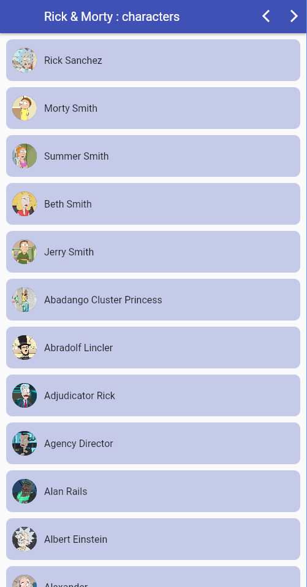
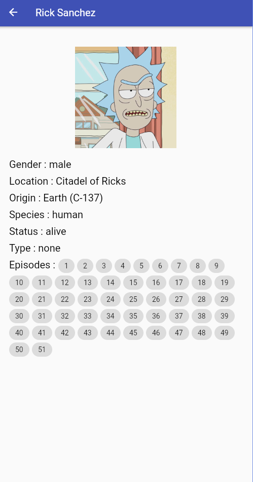
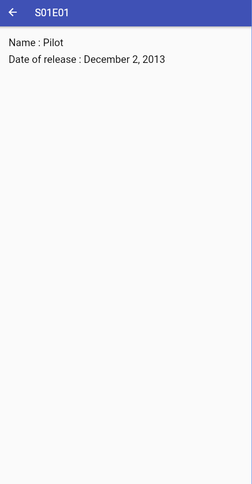

# exercice_rick_et_morty

Learing how to use a RESR API.
- API's link : https://rickandmortyapi.com/api
- API's Doc : https://rickandmortyapi.com/documentation/#rest

## Screens :





## Web ressources : 

Go in ```build/web``` and deploy the content.
